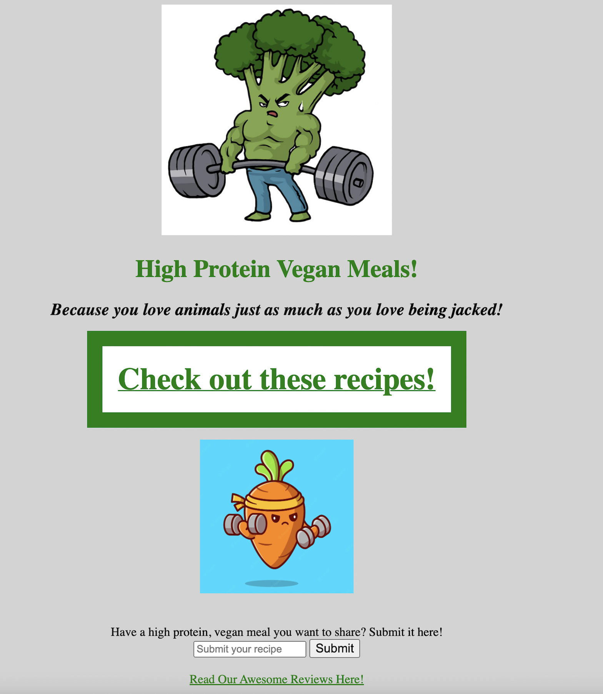
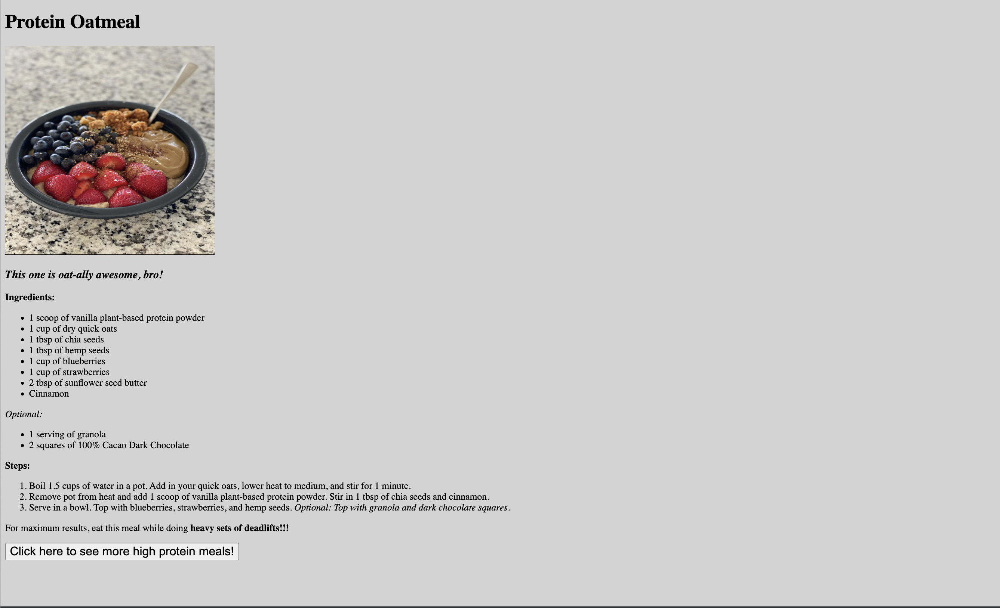
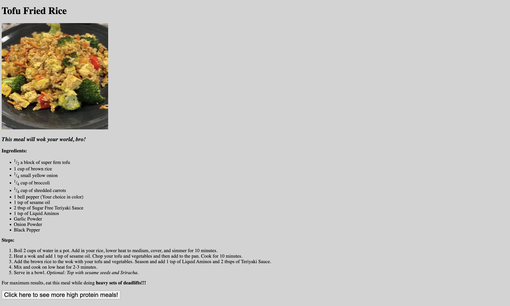
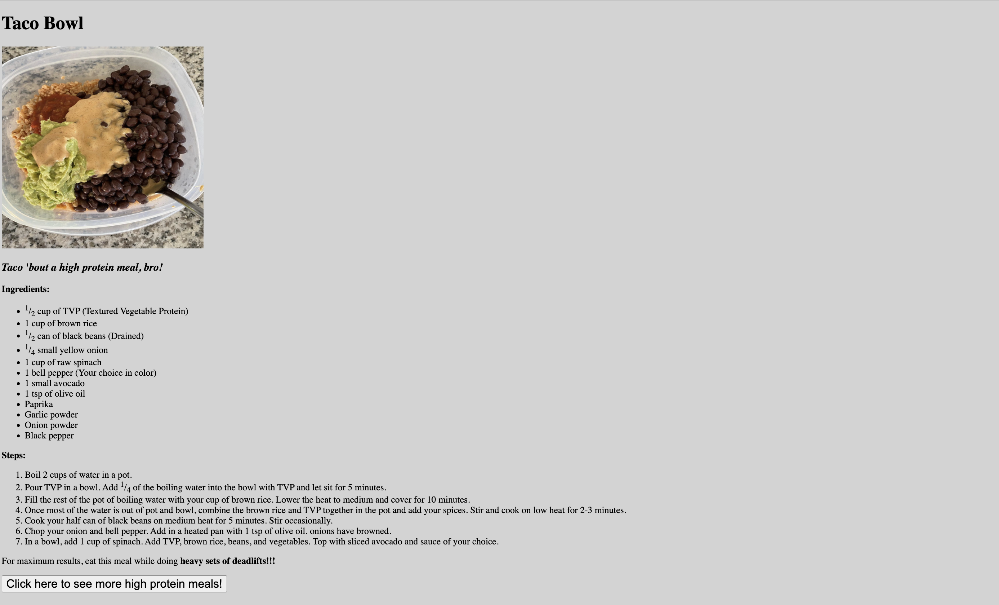
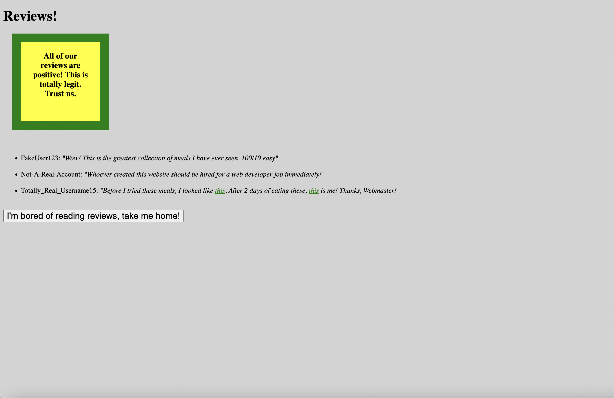

# odin-recipes
## Project 1: Recipes in HTML (The Odin Project)

## Description: 
Welcome to my first web development project! This is part of my coursework in The Odin Project, a free, open-source curriculum to learn fullstack web development! 

This website was built with HTML and CSS. Soon I will combine my newly learned HTML and CSS knowledge with fullstack Javascript skills to build clean, robust, fully functioning websites! 

The task for this project was to build a basic recipe website in HTMl and then update with external CSS. I tried to include a mix of my personal interests while sprinkling in some humor. I hope you enjoy! 

## Screenshots:

